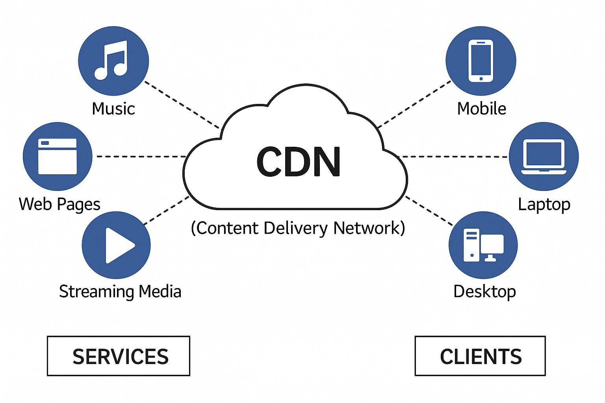

# What is CDN?

A Content Delivery Network (CDN) is a globally distributed system of interconnected servers and edge data centers designed to accelerate the delivery of web content to users, regardless of their geographical location. By caching static and dynamic content such as images, videos, stylesheets, and scripts at edge servers located closer to end-users, a CDN significantly reduces latency, improves website load times, and enhances overall performance and reliability.

When a user requests content from a website, the CDN delivers it from the nearest edge server, rather than from a potentially distant origin server. This minimizes the distance data must travel, resulting in faster load times, reduced bandwidth consumption, and improved resilience under heavy traffic or DDoS attacks.

Modern CDNs, like Azure CDN, Cloudflare, and AWS CloudFront, go beyond simple caching to offer security enhancements (e.g., DDoS protection, TLS termination), edge computing capabilities, and real-time performance optimizations.

# Need of CDN

🎬 **Scenario: Streaming a Movie on an OTT Platform (e.g., Netflix, Hotstar)**

🧍‍♂️ The User:
A person in Kolkata, India wants to watch a movie hosted by a company whose main servers are in the US (California).

❌ Without a CDN:
- When the user hits "Play", their request travels all the way to California.
- The server processes the request and sends back the video data over long distances.
- The video loads slowly, buffers frequently, and might even stop during peak hours.

Experience = ❌ Poor, especially for HD/4K content.

✅ With a CDN:
- The video is already cached at an edge server in Mumbai or Delhi (nearest to the user).
- The request is routed to this local CDN server.
- Video starts instantly, plays smoothly with no buffering.

Experience = ✅ Excellent, even during high traffic.

# Terminoligies related to CDN

1. __Origin Server :__

    An origin server is the central source where the original version of a website's content is stored. It handles the core application logic, dynamic content generation, database interactions, and serves as the single source of truth for all assets — both static and dynamic.

2. __Edge Server :__

    edge servers are distributed globally and form part of a Content Delivery Network (CDN). They are strategically located at Internet Exchange Points (IXPs) — key data hubs between networks — allowing them to serve content much closer to end users.

    Edge servers cache static content such as images, stylesheets, JavaScript files, and even entire HTML pages. This offloads the traffic from the origin server and reduces the distance data must travel, resulting in faster load times, lower latency, and better scalability under heavy load.

    Modern edge servers also perform lightweight computation like URL rewrites, geo-based redirects, security checks, and response customization — all without needing to contact the origin server. This allows the origin to focus on dynamic requests and critical backend tasks, while edge servers handle speed, scale, and responsiveness at the network’s edge.